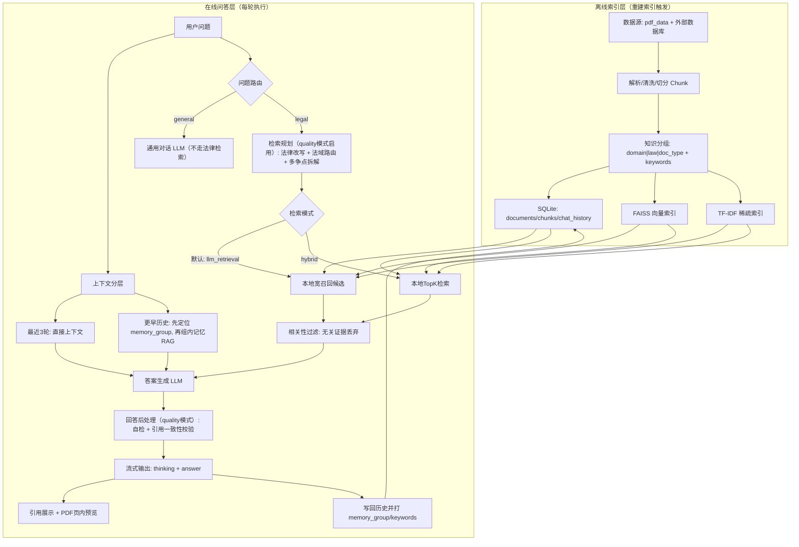

# 法律 RAG 知识库助手架构说明（更新版）

## 1. 架构目标

本系统面向法律问答，核心目标是“证据可追溯 + 检索成本可控 + 长对话可持续”。

1. 每轮实时检索、实时生成，不做在线参数训练。
2. 默认问答模式为 `llm_retrieval`（大模型检索模式）。
3. 上下文采用分层记忆：最近 3 轮直接注入，更早历史走记忆 RAG。
4. 检索和引用采用严格策略：无关证据直接丢弃，不展示伪引用。
5. 数据缺失采用 fail-fast（不做兜底静默吞错，便于定位问题）。

## 2. 总体架构图

## 3. 关键链路说明

### 3.1 检索链路

1. 本地检索由 `dense + sparse + term + (可选)rerank` 组成。
2. 先做知识分组定位，再在组内做候选召回与打分。
3. `llm_retrieval` 下由 LLM在候选内筛选证据并生成答案。
4. `hybrid` 下本地分数主导候选集合，再由 LLM组织答案。

### 3.2 记忆链路

1. 最近 3 轮直接进入 prompt，保证追问连续性。
2. 更早历史不全量拼接，而是按 `memory_group` 外层过滤，再做组内记忆检索。
3. 记忆召回受 `relevance` 阈值控制，降低噪声历史干扰。

### 3.3 提示词工程链路（按档位）

1. `fast`：保留核心问答链路，跳过改写/自检/引用一致性校验，优先速度。
2. `quality`：启用法律改写、法域路由、多争点拆解、回答后自检、引用一致性校验，优先准确性。

## 4. 输出与可信性

1. 输出采用流式（thinking 与 answer 分段流出）。
2. 引用展示包含来源、页码、片段，并支持 PDF 页内预览。
3. 回答中要求落到“法律名称 + 第 X 条”，并以候选证据编号对齐引用。

## 5. 实时调用与训练边界

1. 实时发生的只有检索、推理、历史写回。
2. embedding/reranker/LLM 参数不会在对话中在线更新。
3. “重建索引”会重新解析数据源并重建索引资产。

## 6. 关键实现文件

1. 工作流与提示词工程：`D:\PythonFile\JCAI\RAG\legal_agent\workflow.py`
2. 本地检索与分组召回：`D:\PythonFile\JCAI\RAG\legal_agent\retrieval.py`
3. 会话记忆检索：`D:\PythonFile\JCAI\RAG\legal_agent\memory.py`
4. 存储与历史管理：`D:\PythonFile\JCAI\RAG\legal_agent\storage.py`
5. 交互界面与 PDF 预览：`D:\PythonFile\JCAI\RAG\app.py`
